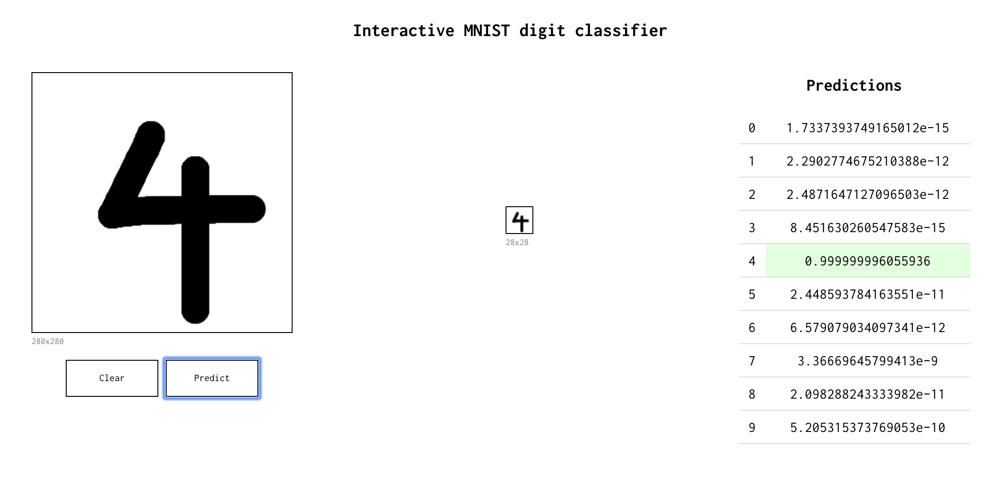

<h1> Learning TensorFlow </h1>

This repository contains various methods to classify the MNIST dataset. 

<ul>
<li> Linear Regression </li>
<li> Simple Neural Network </li>
<li> Convolutional Neural Network </li>
</ul>

Each method increases in complexity introducing various features of tensorflow. It also integrates TensorBoard logging to visualize the algorithm.

Also contains a client to test out the implemented model done with Flask

